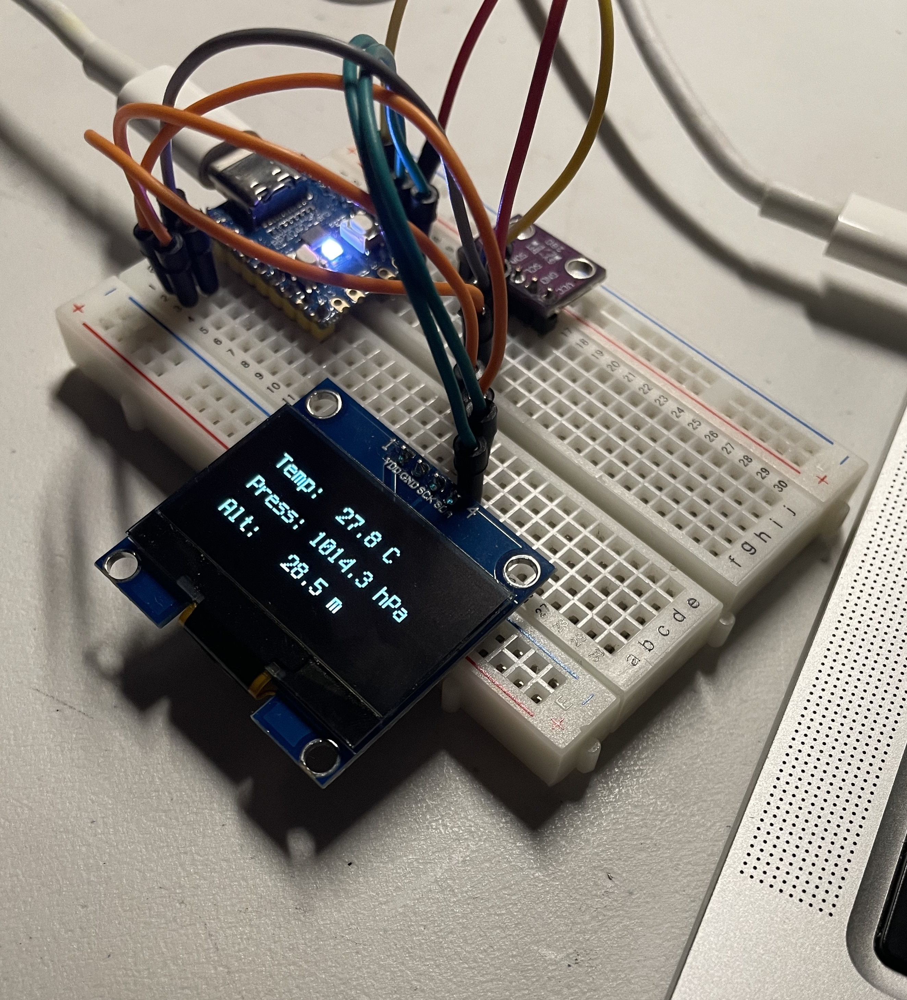

## outdoorsy-gadget

making a thing to track the weather when outdoors. it measures temperature, altitude (pressure), and humidity through the BME280 sensor.

## setup
Notes for myself since no one is gonna read this, yay

To set up [circuitpython](https://github.com/adafruit/circuitpython), we use the .uf2 file.

Hold `BOOT` while plugging the RP2040-zero to the computer, and there should be a disk called `RPI-RP2`. That is the RP2040's bootloader, which is like its disk. Drag the `.uf2` into this, and it should disappear and reappear as whatever firmware you flashed onto it.

Now it should be named `CIRCUITPY`. Yay it's now running circuitpython!

Now use Thonny and do Thonny setup.
- Options: Interpreter -> Circuitpython (generic)

Alternatively use vscode but I haven't figured that part out yet.

### pictures yay

timeskip: about 3 days. the e-ink works but it has a terribly long refresh rate so I'm waiting a while to get another monochrome one.

so far we're testing the e-ink logic on the OLED (xd)

testing out a bmp (oops)

### hardware list for this
- a waveshare RP2040-zero
- BME280 (soon)
- BMP280 (for now)
- bambu A1 mini -> case
- 1.54 Inch E-Ink Display Three Color E-Paper Screen for Raspberry Pi/Arduino/Jetson Nano/STM32 200x200 Pixels Red Black White SPI Interface - SEENGREAT

